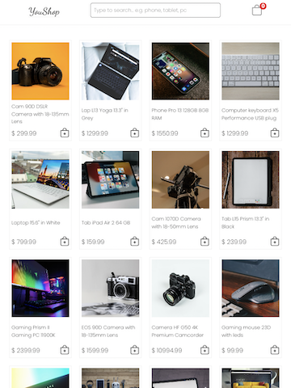

# <h3>React Redux shopping cart</h3>

<h2><a href="https://yanshtein.github.io/shopping-cart-react-redux/" rel="nofollow">Live Demo</a></h2>

This project uses responsive React-Redux shopping cart app, which consists of a few products and a DB.

<b>Project functionality:</b>

react-redux:
- Provider holds "store" prop which is used to manage states through all the app components.

Home page: 
- has a search functionality which based on search input will show filtered results, else it will show all the products from the DB.
- each item has an add to cart button, when pressed:
- the cart quantity will update by 1.
- The item will be added to Cart items array.

Cart page holds all items added to cart:
- Items details (title, price..)
- Modify each item quantity will trigger addToCart() / removeFromcart() -> and will be updated in cart array.
- Empty cart button triggers emptyCart() setting cart array to initial state.

Checkout page presents items cart summary, and payment details:
- if cart is empty the Pay button is disabled, unless it holds at least one item.

- React Router manages routing in all the components.

